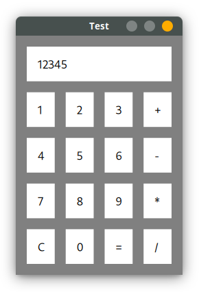

The current trend in Rust UI libraries seems to be towards relaxed,
immediate-mode APIs that guarantee little and have fairly significant refresh
overhead. This crate is an attempt by me to shake things up and build something
declarative, fast, structured, type-safe and with a clean separation between
data and UI state. Judge the success of this attempt for yourself.

## Example

```rust
#[derive(Default)]
struct Data {
    screen: String,
    second: f64,
    op: Option<fn(f64, f64) -> f64>,
}

impl Data {
    fn start_op(&mut self, op: fn(f64, f64) -> f64) {
        self.second = std::mem::take(&mut self.screen).parse().unwrap();
        self.op = Some(op);
    }

    fn calc(&mut self) {
        let screen = self.screen.parse().unwrap_or(0.0);
        self.screen = match self.op.take() {
            Some(op) => op(self.second, screen),
            None => return,
        }.to_string();
    }
}

let num_button = |n: &'static str| Button::<Data>::default_state()
    .containing(Label::<Data>::with_state(n).padded(16.0))
    .on(Click, move |ctx| ctx.data.screen.push_str(&n))
    .padded(8.0);

let ui = List::<Data>::vertical()
    .push(Button::<Data>::default_state()
        .containing(Label::<Data>::bind_state(|d| &mut d.screen).padded(16.0))
        .padded(8.0))
    .push(List::<Data>::horizontal()
        .push(num_button("1"))
        .push(num_button("2"))
        .push(num_button("3"))
        .push(Button::<Data>::default_state()
            .containing(Label::<Data>::with_state("+").padded(16.0))
            .on(Click, |ctx| ctx.data.start_op(|x, y| x + y))
            .padded(8.0)))
    .push(List::<Data>::horizontal()
        .push(num_button("4"))
        .push(num_button("5"))
        .push(num_button("6"))
        .push(Button::<Data>::default_state()
            .containing(Label::<Data>::with_state("-").padded(16.0))
            .on(Click, |ctx| ctx.data.start_op(|x, y| x - y))
            .padded(8.0)))
    .push(List::<Data>::horizontal()
        .push(num_button("7"))
        .push(num_button("8"))
        .push(num_button("9"))
        .push(Button::<Data>::default_state()
            .containing(Label::<Data>::with_state("*").padded(16.0))
            .on(Click, |ctx| ctx.data.start_op(|x, y| x * y))
            .padded(8.0)))
    .push(List::<Data>::horizontal()
        .push(Button::<Data>::default_state()
            .containing(Label::<Data>::with_state("C").padded(16.0))
            .on(Click, |ctx| ctx.data.screen.clear())
            .padded(8.0))
        .push(num_button("0"))
        .push(Button::<Data>::default_state()
            .containing(Label::<Data>::with_state("=").padded(16.0))
            .on(Click, |ctx| ctx.data.calc())
            .padded(8.0))
        .push(Button::<Data>::default_state()
            .containing(Label::<Data>::with_state("/").padded(16.0))
            .on(Click, |ctx| ctx.data.start_op(|x, y| x / y))
            .padded(8.0)))
    .padded(8.0);

Window::new(ui).run(Data::default())
```

# 
